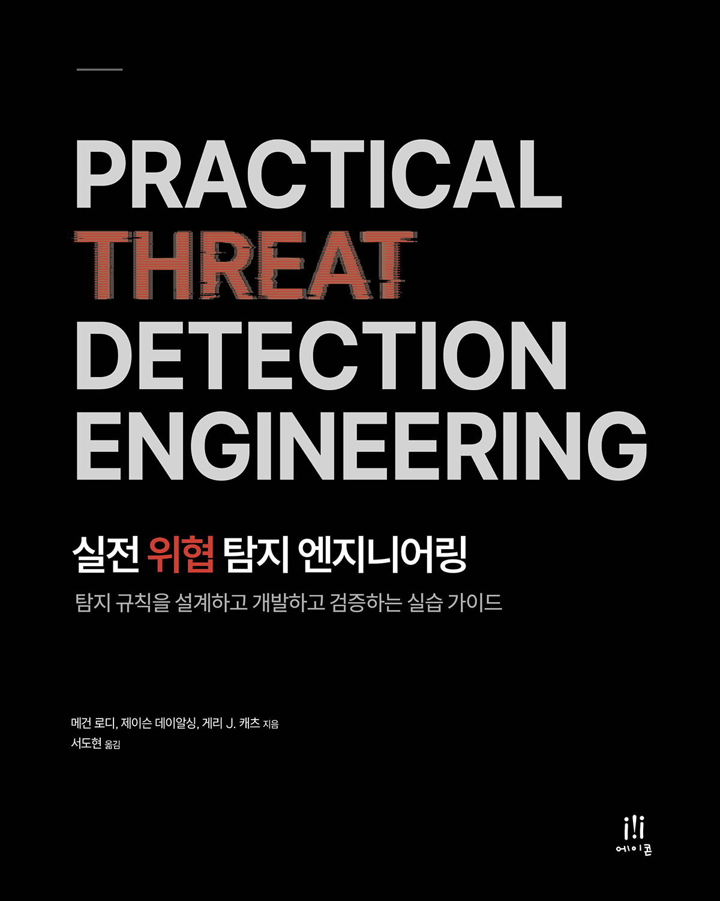

# 실전 위협 탐지 엔지니어링

<a href="http://www.acornpub.co.kr/book/9791161757407"></a>

이 페이지에서 도서의 **예제 코드**를 다운로드할 수 있습니다.

아래 두 가지 방법 중 편한 방법을 선택하세요.

- **ZIP 다운로드**: 페이지 상단의 `<> Code` 버튼을 클릭한 후 `Download ZIP`을 선택합니다.
- **Git 클론**: 터미널에서 다음 명령어를 실행합니다.

```bash
git clone https://github.com/AcornPublishing/9791161757407.git
```

<br clear="both">

## 문의

도서나 예제 코드에 관해 궁금한 점이 있으시면 아래로 연락해 주세요.

- 에이콘출판사 편집팀: [editor@acornpub.co.kr](mailto:editor@acornpub.co.kr)
- 역자: [securelambda@gmail.com](mailto:securelambda@gmail.com)